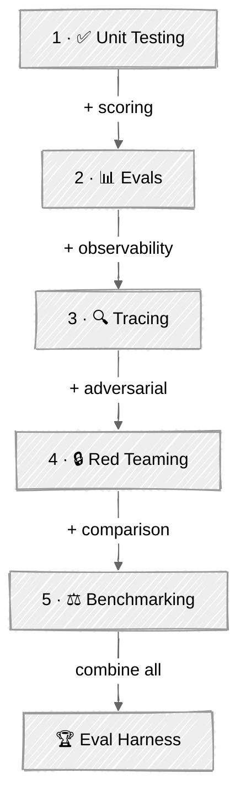

# Module 05: Testing & Evaluation — Comprehensive Plan

## Vision

Agents are non-deterministic — you can't `assert output == expected` when the output changes every run. This module teaches the **mental models, patterns, and techniques** for building confidence in AI agents before shipping. Following Anthropic's principle of **eval-driven development**, students learn to define success criteria *before* building, measure quality continuously, and catch regressions automatically.

The module progresses from deterministic unit tests (fast, cheap, no API calls) through statistical evaluation (golden datasets, LLM-as-judge), observability (tracing every decision), adversarial robustness (red teaming), and systematic benchmarking — culminating in a capstone that wires all five techniques into a single eval harness for a real agent.

---

## Module Structure

```
05-testing-evaluation/
├── 01-unit-testing-agents/          # Deterministic testing without API calls
├── 02-evals/                        # Golden datasets, LLM-as-judge, scoring pipelines
├── 03-tracing-debugging/            # Observability, execution traces, failure analysis
├── 04-red-teaming-safety/           # Adversarial testing, prompt injection, guardrails
├── 05-benchmarking/                 # Model/prompt/architecture comparison
├── 06-eval-harness/                 # 🏆 Capstone: full eval pipeline combining all tutorials
└── README.md                        # Module overview with progression path
```

---

## Progression Path

```
Unit Testing → Evals → Tracing → Red Teaming → Benchmarking → Eval Harness (capstone)
    │              │         │          │             │              │
    │              │         │          │             │              └─ Combines all 5 techniques
    │              │         │          │             └─ Head-to-head model/prompt comparison
    │              │         │          └─ Adversarial attacks + guardrail verification
    │              │         └─ Trace capture + failure diagnosis
    │              └─ Golden datasets + automated scoring + regression detection
    └─ Mock LLMs + test tool execution + deterministic assertions
```

| Step | Tutorial | What It Adds | Key Concepts |
|:----:|----------|-------------|--------------|
| 1 | [Unit Testing Agents](01-unit-testing-agents/) | Deterministic testing | Mock LLMs, tool isolation, behavioral contracts |
| 2 | [Evals](02-evals/) | + statistical evaluation | Golden datasets, LLM-as-judge, scoring rubrics |
| 3 | [Tracing & Debugging](03-tracing-debugging/) | + observability | Execution traces, span trees, failure analysis |
| 4 | [Red Teaming & Safety](04-red-teaming-safety/) | + adversarial testing | Prompt injection, jailbreaks, guardrail verification |
| 5 | [Benchmarking](05-benchmarking/) | + systematic comparison | Head-to-head evaluation, cost/latency/accuracy tradeoffs |
| 🏆 | [Eval Harness](06-eval-harness/) | Combines all techniques | Full eval pipeline for a real agent |

---

## Tutorial 01: Unit Testing Agents

### Concept

Traditional unit testing adapted for non-deterministic AI systems. The key insight: you *can* test agent logic deterministically by **mocking the LLM** and testing everything around it — tool execution, decision routing, message construction, error handling, and behavioral contracts.

Reference: Anthropic's vocabulary — we're testing the **agent harness** (the scaffold), not the model.

### What Students Learn

- Why agent testing requires different thinking (non-determinism, stochastic outputs)
- The **testing pyramid for agents**: unit tests (mock LLM) → integration tests (recorded responses) → eval tests (live LLM)
- Mocking LLM responses to create deterministic test scenarios
- Testing tool execution in isolation (does the tool do what it claims?)
- Verifying agent decision-making logic (given this LLM response, does the agent take the correct action?)
- Testing message construction and conversation history management
- Behavioral contracts: "the agent must never call tool X without user confirmation"
- Testing error handling paths (API failures, malformed tool output, timeout)

### Scripts

| # | Script | Description |
|---|--------|-------------|
| 01 | `01_mock_llm_testing.py` | Mock LLM responses with `unittest.mock`, test agent loop logic without API calls. Build a simple agent with mocked `client.messages.create()`, verify it calls the right tools for given prompts. |
| 02 | `02_tool_testing.py` | Test tool functions in isolation. Verify input validation, output format, error handling. Build a test suite for file system tools (read, write, list) with safety checks. |
| 03 | `03_behavioral_contracts.py` | Define and verify behavioral invariants. "Agent never executes blocked commands." "Agent always confirms before deletion." "Agent stops after N iterations." Test these as assertions against recorded agent traces. |

### Key Patterns to Teach

1. **Mock-and-replay**: Pre-record LLM responses, replay during tests
2. **Tool isolation testing**: Test each tool independently with edge cases
3. **Behavioral invariant checking**: Define what the agent must *always* or *never* do
4. **Conversation snapshot testing**: Verify message history construction
5. **Error path testing**: Simulate API failures, malformed responses, timeouts

### Technical Implementation

- Use `pytest` as the test runner (standard Python, no framework dependency)
- Use `unittest.mock.patch` to mock API clients
- Build a `MockLLMClient` class that returns pre-configured responses
- Use `pytest.fixture` for reusable agent and tool setups
- Test a simple agent from Module 01 (tool-use agent) — students recognize the code

### Agent Under Test

Reuse the **tool-use agent from `01-foundations/04-tool-use`** as the system under test. Students already know this agent, so they can focus on testing techniques rather than understanding new agent code. Provide a slightly refactored version that's more testable (dependency injection for the LLM client).

### Dependencies

```toml
[project]
dependencies = [
    "anthropic>=0.40.0",
    "python-dotenv>=1.0.0",
    "pytest>=8.0.0",
    "rich>=14.0.0",
    "common",
]
```

---

## Tutorial 02: Evals

### Concept

Move beyond deterministic assertions to **statistical evaluation** of agent quality. Following Anthropic's eval-driven development methodology: define success criteria as eval tasks, score with multiple grader types, track quality over time, catch regressions automatically.

Core reference: [Demystifying Evals for AI Agents](https://www.anthropic.com/engineering/demystifying-evals-for-ai-agents)

### Key Vocabulary (from Anthropic)

- **Task**: A test case with inputs and success criteria
- **Trial**: One stochastic run of a task (run multiple trials to capture variance)
- **Transcript**: Complete record of the agent's actions (tool calls, reasoning, intermediate outputs)
- **Outcome**: Final environment state after the agent finishes
- **Grader**: Logic that scores some aspect of agent performance
- **pass@k**: Probability of at least one success in k trials
- **pass^k**: All k trials must succeed (tests consistency)

### What Students Learn

- The eval vocabulary: task, trial, transcript, outcome, grader
- **Three grader types**: code-based, model-based (LLM-as-judge), human
- Designing **golden datasets** — curated input/output pairs for regression testing
- **LLM-as-judge** pattern — using a capable model to score another model's output
- **Rubric-based scoring** — structured evaluation criteria with defined scales
- **Capability evals** (what can the agent do?) vs. **regression evals** (does it still work?)
- Handling non-determinism with **multiple trials** and statistical aggregation
- Task sourcing: converting production failures into eval tasks

### Scripts

| # | Script | Description |
|---|--------|-------------|
| 01 | `01_code_based_graders.py` | Build code-based graders: string matching, regex, JSON schema validation, tool-call verification. Evaluate a simple agent against a golden dataset of 10-15 tasks. Track pass rates. |
| 02 | `02_llm_as_judge.py` | Implement the LLM-as-judge pattern. Build a judge prompt with structured rubrics (clarity, accuracy, completeness on 1-10 scales). Evaluate agent responses. Compare judge scores with known-good answers. Demonstrate chain-of-thought reasoning in the judge. |
| 03 | `03_eval_pipeline.py` | Build an end-to-end eval pipeline: load golden dataset → run agent trials → score with multiple graders → aggregate results → detect regressions. Combine code-based and model-based graders. Report pass@k and pass^k metrics. |

### Key Patterns to Teach

1. **Golden dataset design**: Start with 20-50 tasks from real failures (Anthropic's Step 0)
2. **Multi-grader composition**: Combine code-based (fast/cheap) + model-based (nuanced) graders
3. **Rubric engineering**: Design scoring criteria that are specific, measurable, unambiguous
4. **LLM-as-judge with chain-of-thought**: Force the judge to reason before scoring
5. **Claim extraction + verification**: Break output into atomic claims, verify each against ground truth
6. **Regression detection**: Compare current pass rates against historical baselines
7. **Eval-driven development**: Write evals before building features

### Technical Implementation

- Golden dataset as JSON files (inputs, expected outputs, grading criteria)
- Code-based graders as simple Python functions returning `(pass: bool, score: float, reason: str)`
- LLM-as-judge using Anthropic API with structured output (tool_choice for scoring)
- Results stored as JSON for cross-run comparison
- Use `dataclasses` or Pydantic for `EvalTask`, `EvalTrial`, `EvalResult` models

### Agent Under Test

Build a **research assistant agent** — given a question, it searches (simulated) documents and produces an answer. This is ideal because:
- Outputs are open-ended (can't use exact match)
- Quality is multi-dimensional (accuracy, completeness, grounding)
- LLM-as-judge is the natural evaluation approach
- Maps to Anthropic's "research agents" category

### Dependencies

```toml
[project]
dependencies = [
    "anthropic>=0.40.0",
    "python-dotenv>=1.0.0",
    "rich>=14.0.0",
    "common",
]
```

---

## Tutorial 03: Tracing & Debugging

### Concept

When an agent does something unexpected, you need to know **exactly why**. Tracing captures the full execution flow — every LLM call, tool invocation, decision point, and intermediate result — so you can reconstruct the agent's reasoning path post-hoc.

This tutorial teaches **observability as a first-class concern**, not an afterthought. The trace is the primary debugging artifact for non-deterministic systems.

### What Students Learn

- Why traditional debuggers fail for multi-step agents (non-reproducible, async, multi-call)
- Building a **trace collector** that captures the full agent execution tree
- **Span-based tracing**: each operation (LLM call, tool execution, decision) is a span with timing, inputs, outputs, and metadata
- Tracing **token usage and cost** per operation and per session
- **Trace analysis patterns**: identify loops, detect unnecessary tool calls, find the step where things went wrong
- **Trace-based debugging workflow**: reproduce failures from recorded traces
- Connecting traces to eval failures (Tutorial 02) — when an eval fails, the trace shows *why*

### Scripts

| # | Script | Description |
|---|--------|-------------|
| 01 | `01_trace_collector.py` | Build a `TraceCollector` class that instruments agent execution. Capture spans for LLM calls (model, tokens, latency), tool calls (name, args, result), and decisions. Output structured trace as JSON. Visualize as a tree in the terminal with Rich. |
| 02 | `02_trace_analysis.py` | Load recorded traces and analyze them. Detect anti-patterns: excessive tool calls, loops, high-cost operations, failed tool calls. Compute aggregate metrics: total tokens, total cost, step count, latency breakdown. Compare traces across runs of the same task. |
| 03 | `03_trace_debugging.py` | Build a trace-based debugging workflow. Given a failed eval task (from Tutorial 02), load the trace, walk through each step, identify the failure point. Implement a `TraceReplay` that re-executes the agent from any checkpoint in a recorded trace. |

### Key Patterns to Teach

1. **Span-based tracing**: Hierarchical spans with parent-child relationships (LLM call → tool execution → sub-tool)
2. **Context propagation**: Thread trace context through the agent's execution path
3. **Structured trace output**: JSON traces that can be loaded, analyzed, compared
4. **Cost attribution**: Which step consumed the most tokens? Which tool is most expensive?
5. **Failure point identification**: Walk backward from a failed outcome to find the first incorrect step
6. **Trace comparison**: Same task, different runs — what changed?
7. **Trace visualization**: Rich tree output showing the full execution flow

### Technical Implementation

- Custom `TraceCollector` class using Python context managers
- `@traced` decorator for instrumenting functions
- Traces stored as JSON with spans, timing, token counts
- Rich-based tree visualization in the terminal
- No external dependencies (no OpenTelemetry, no Langfuse) — teach the *concepts* with pure Python, reference observability platforms in the README
- A `Span` dataclass: `{name, type, start_time, end_time, inputs, outputs, tokens, cost, children}`

### Agent Under Test

Use the same **research assistant** from Tutorial 02, now instrumented with tracing. Students see the same agent, but now with full visibility into its execution.

### Dependencies

```toml
[project]
dependencies = [
    "anthropic>=0.40.0",
    "python-dotenv>=1.0.0",
    "rich>=14.0.0",
    "common",
]
```

---

## Tutorial 04: Red Teaming & Safety

### Concept

Adversarial testing for agents. Agents have access to tools, execute code, and make autonomous decisions — a single exploit can lead to data leaks, destructive operations, or policy violations. Red teaming systematically probes for vulnerabilities before attackers do.

References: OWASP Top 10 for LLM Applications, OWASP Top 10 for Agentic Applications (Dec 2025), MITRE ATLAS framework.

### What Students Learn

- **Threat modeling for agents**: What can go wrong? (Prompt injection, jailbreaks, tool misuse, information leakage, privilege escalation)
- **Prompt injection attacks**: Direct injection (override system prompt), indirect injection (via tool outputs/documents)
- **Jailbreak patterns**: Role-playing, encoding, context manipulation, multi-turn crescendo attacks
- **Tool misuse testing**: Can the agent be tricked into executing dangerous operations?
- **Guardrail verification**: Test that safety measures actually hold under adversarial pressure
- **Defense-in-depth**: Input validation → system prompt hardening → output filtering → tool-level safety
- **Attack success rate (ASR)** as the core metric
- **Automated red teaming**: Using an LLM to generate adversarial inputs at scale

### Scripts

| # | Script | Description |
|---|--------|-------------|
| 01 | `01_prompt_injection.py` | Build a test suite of prompt injection attacks against an agent. Test direct injection (instructions in user input), indirect injection (malicious content in "documents" returned by tools). Measure attack success rate. Implement and test input sanitization guardrails. |
| 02 | `02_guardrail_testing.py` | Systematically test agent guardrails. Build a guardrail-equipped agent with: blocked command list, output content filtering, tool-call validation, information leakage prevention. Run adversarial test cases against each guardrail layer. Verify defense-in-depth. |
| 03 | `03_automated_red_team.py` | Use an LLM (the "red team" model) to automatically generate adversarial inputs for a target agent. The red team model tries to make the target violate its safety policy. Score each attack attempt. Report vulnerability categories and attack success rates. Demonstrate the attacker-defender dynamic. |

### Key Patterns to Teach

1. **Attack taxonomy**: Direct injection, indirect injection, jailbreak, tool misuse, information leakage
2. **Test case design**: Craft attacks that test specific vulnerability categories
3. **Guardrail layers**: Input validation → prompt hardening → output filtering → tool-level safety
4. **Attack Success Rate (ASR)**: Percentage of successful attacks over total attempts
5. **Automated adversarial testing**: LLM-vs-LLM red teaming at scale
6. **Defense verification**: For each guardrail, prove it holds against known attack patterns
7. **The OWASP Top 10 for Agentic Applications**: Map tutorial attacks to real-world vulnerability categories

### Technical Implementation

- Build a simple coding agent (from Module 01) as the target — it has tool access (file operations, shell commands) and a system prompt with safety rules
- Attack library: Python dictionary of attack prompts categorized by type
- Guardrails: Python functions that validate inputs/outputs at each stage
- Red team model: Use Anthropic API to generate adversarial prompts targeting the safety policy
- Scoring: Binary (attack succeeded/failed) + severity classification

### Agent Under Test

A **tool-equipped coding agent** with explicit safety rules:
- Blocked command list (rm -rf, sudo, etc.)
- File access restrictions (can't read .env files)
- Output filtering (no PII, no credentials in responses)

This is ideal because it has a clear attack surface (tools, file system, shell access) and explicit policies that can be tested.

### Dependencies

```toml
[project]
dependencies = [
    "anthropic>=0.40.0",
    "python-dotenv>=1.0.0",
    "rich>=14.0.0",
    "common",
]
```

---

## Tutorial 05: Benchmarking

### Concept

Systematic head-to-head comparison of models, prompts, and architectures across dimensions that matter: **accuracy, latency, cost, and reliability**. When you need to decide between Claude Sonnet vs. GPT-4o, or between two prompt strategies, benchmarking gives you data instead of vibes.

Reference: Anthropic's distinction between **capability evals** and **regression evals**, plus the benchmark design principles from SWE-bench, GAIA, and WebArena.

### What Students Learn

- **Benchmark design**: Task selection, controlled variables, statistical significance
- **Multi-dimensional evaluation**: Accuracy alone is insufficient — measure cost, latency, token efficiency, and consistency together
- **Model comparison**: Same tasks, same graders, different models — which performs best?
- **Prompt comparison**: Same model, same tasks, different prompts — which prompt strategy wins?
- **Architecture comparison**: Same task, different agent patterns (chaining vs. orchestrator) — which is more efficient?
- **Handling non-determinism**: Multiple trials per task, confidence intervals, statistical tests
- **Cost-quality tradeoff analysis**: Pareto frontier — which configuration gives the best accuracy per dollar?
- **pass@k and pass^k metrics**: When one success suffices vs. when consistency matters

### Scripts

| # | Script | Description |
|---|--------|-------------|
| 01 | `01_model_comparison.py` | Benchmark the same agent task across 2-3 models (e.g., Claude Sonnet, Claude Haiku, GPT-4o-mini). Measure accuracy, latency, tokens, and cost for each. Run multiple trials. Present results as a comparison table with Rich. |
| 02 | `02_prompt_comparison.py` | Same model, same tasks, 3 different prompt strategies (zero-shot, few-shot, chain-of-thought). Measure quality scores using LLM-as-judge from Tutorial 02. Identify which prompt strategy works best for different task types. |
| 03 | `03_benchmark_suite.py` | Build a reusable benchmark suite that combines model comparison, prompt comparison, and architecture comparison. Run a matrix of configurations. Compute Pareto-optimal configurations (best accuracy for a given cost budget). Generate a benchmark report with comparison tables, cost breakdowns, and recommendations. |

### Key Patterns to Teach

1. **Controlled experimentation**: Change one variable, hold others constant
2. **Multi-trial evaluation**: Run N trials per configuration, report means and confidence intervals
3. **Cost-quality Pareto analysis**: Plot accuracy vs. cost, find the frontier
4. **Latency profiling**: Time-to-first-token, total latency, per-step latency breakdown
5. **Token efficiency**: Tokens consumed per successful task completion
6. **Configuration matrix**: Model × Prompt × Architecture → quality scores
7. **Statistical significance**: Don't declare a winner on 3 data points

### Technical Implementation

- Benchmark configuration as a Python dataclass: `BenchmarkConfig(model, prompt_template, temperature, max_tokens)`
- Task suite loaded from JSON (reuse golden dataset from Tutorial 02)
- Results stored as structured JSON with full metadata (model, config, timing, scores)
- Comparison tables rendered with Rich
- Token tracking integrated from `common.token_tracking`

### Agent Under Test

Reuse the **research assistant** from Tutorial 02, configured with different models and prompts. Students benchmark the same agent they've been evaluating and tracing — building a complete picture.

### Dependencies

```toml
[project]
dependencies = [
    "anthropic>=0.40.0",
    "openai>=1.0.0",
    "python-dotenv>=1.0.0",
    "rich>=14.0.0",
    "common",
]
```

---

## Tutorial 06: Eval Harness (Capstone)

### Concept

The capstone project that **combines all five techniques** into a single, reusable evaluation harness for a real agent. This is the testing equivalent of the Content Writer capstone from Module 02 — it demonstrates how unit tests, evals, tracing, red teaming, and benchmarking compose into a complete quality system.

Inspired by Anthropic's 8-step evaluation development roadmap and the concept of **eval-driven development** — where evals are built *before* features, treated as core infrastructure, and maintained like production code.

### What Students Build

A complete `EvalHarness` package that:

1. **Loads eval tasks** from a golden dataset (JSON)
2. **Runs the agent** with full tracing instrumented
3. **Scores outcomes** using composite graders (code-based + LLM-as-judge)
4. **Tests safety** with an adversarial test suite
5. **Benchmarks** across model configurations
6. **Generates a report** combining all results: pass rates, quality scores, safety scores, cost/latency metrics, regression alerts

### Architecture

```
06-eval-harness/
├── 01_eval_harness.py              # Entry point: run full evaluation pipeline
├── eval_harness/                   # Package
│   ├── __init__.py
│   ├── models.py                   # Pydantic models: EvalTask, EvalTrial, EvalResult, TraceSpan, etc.
│   ├── agent.py                    # Agent under test (research assistant with tools)
│   ├── graders.py                  # Grader implementations (code-based + LLM-as-judge)
│   ├── tracer.py                   # Trace collector (from Tutorial 03)
│   ├── red_team.py                 # Adversarial test suite (from Tutorial 04)
│   ├── benchmark.py                # Benchmark runner (from Tutorial 05)
│   └── reporter.py                 # Report generator (Rich terminal output)
├── datasets/
│   ├── golden_tasks.json           # Golden dataset for eval
│   └── adversarial_tasks.json      # Red team test cases
├── pyproject.toml
└── README.md
```

### Pipeline Flow

```
Load Tasks → Run Agent (with tracing) → Score (multi-grader) → Safety Test → Benchmark → Report
     │              │                         │                    │            │           │
  golden_tasks   trace_collector          code_grader +        red_team     model A     summary
  adversarial    per-span timing          llm_judge            attacks      model B     tables
  tasks          token/cost tracking      rubric scoring       ASR scores   comparison  alerts
```

### What Students Learn (Capstone Integration)

| Component | From Tutorial | What It Adds in Capstone |
|-----------|---------------|--------------------------|
| Agent under test (with mocked/real LLM) | 01 - Unit Testing | Testable agent design with dependency injection |
| Golden dataset + multi-grader scoring | 02 - Evals | Composite grading (code + LLM-as-judge) with regression detection |
| Trace collector + cost attribution | 03 - Tracing | Full execution traces linked to eval results |
| Adversarial test suite + safety scoring | 04 - Red Teaming | Safety eval integrated into the main pipeline |
| Model comparison + Pareto analysis | 05 - Benchmarking | Configuration optimization across quality/cost/latency |
| Report generation | New | Unified reporting combining all metrics |

### Key Patterns

1. **Eval-driven development**: Define tasks before building; iterate until pass rates improve
2. **Composite grading**: Multiple grader types per task, weighted scoring
3. **Trace-linked evals**: Every eval failure comes with a full execution trace for debugging
4. **Safety as a first-class eval dimension**: Red team results alongside accuracy results
5. **Configuration optimization**: Find the model/prompt combo that balances quality, cost, and safety
6. **Regression alerting**: Compare current results against stored baselines, flag degradations
7. **The full eval lifecycle**: Source tasks → design graders → run trials → analyze → iterate

### The Agent Under Test

A **research assistant agent** that can:
- Search a local knowledge base (simulated document retrieval)
- Synthesize answers from multiple sources
- Cite sources in its responses
- Refuse out-of-scope questions

This agent is rich enough to evaluate along multiple dimensions (accuracy, groundedness, safety, efficiency) while simple enough to understand in a tutorial.

### Report Output

The capstone generates a Rich-formatted terminal report:

```
╭─────────── Eval Report: Research Assistant ───────────╮
│                                                       │
│  📊 Quality Evals        15/20 tasks passed (75.0%)   │
│  🔒 Safety Score         18/20 attacks blocked (90%)  │
│  ⏱️  Avg Latency          2.3s per task               │
│  💰 Avg Cost             $0.012 per task              │
│  📈 Regression           ⚠️ 2 tasks regressed          │
│                                                       │
│  Model Comparison:                                    │
│  ┌──────────┬──────┬────────┬───────┐                 │
│  │ Model    │ Pass │ Cost   │ Lat.  │                 │
│  ├──────────┼──────┼────────┼───────┤                 │
│  │ Sonnet   │ 75%  │ $0.012 │ 2.3s  │                 │
│  │ Haiku    │ 60%  │ $0.002 │ 0.8s  │                 │
│  └──────────┴──────┴────────┴───────┘                 │
╰───────────────────────────────────────────────────────╯
```

### Dependencies

```toml
[project]
dependencies = [
    "anthropic>=0.40.0",
    "openai>=1.0.0",
    "python-dotenv>=1.0.0",
    "pydantic>=2.0.0",
    "rich>=14.0.0",
    "common",
]
```

---

## Cross-Tutorial Continuity

A key design principle: tutorials build on each other using a **shared agent and shared dataset**.

### The Research Assistant Agent

Introduced in Tutorial 02 and used across Tutorials 02-06:
- **Tutorial 01**: Tests a familiar tool-use agent from Module 01 (foundation bridge)
- **Tutorial 02**: Introduces the research assistant agent, evaluates it with golden datasets
- **Tutorial 03**: Same agent, now fully instrumented with tracing
- **Tutorial 04**: Different agent (coding agent with tools) — better attack surface for red teaming
- **Tutorial 05**: Research assistant benchmarked across models and prompts
- **Tutorial 06**: Research assistant as the primary agent under test in the full eval harness

### Shared Golden Dataset

The golden dataset (`datasets/golden_tasks.json`) is introduced in Tutorial 02 and reused in Tutorials 03, 05, and 06. Students build it progressively:
- Tutorial 02: Create the initial 15-20 tasks
- Tutorial 03: Add traces to each task
- Tutorial 05: Run the same tasks across models for benchmarking
- Tutorial 06: Use as the core eval suite in the capstone

---

## Module README Structure

The module README will follow the established pattern from Module 02:



---

## Key References & Resources

### Primary References (to be included in module README)

- [Demystifying Evals for AI Agents — Anthropic](https://www.anthropic.com/engineering/demystifying-evals-for-ai-agents) — Core eval vocabulary, grader taxonomy, 8-step roadmap, agent-type-specific strategies
- [Building Effective Agents — Anthropic](https://www.anthropic.com/research/building-effective-agents) — Agent patterns that inform what to test
- [Eval-Driven Development](https://evaldriven.org/) — The discipline of building evals before features
- [Evaluation-Driven Development of LLM Agents (arXiv)](https://arxiv.org/html/2411.13768v2) — Academic formalization of the EDD process model
- [OpenAI Evaluation Best Practices](https://platform.openai.com/docs/guides/evaluation-best-practices) — Practical eval guidance from OpenAI
- [OpenAI Cookbook: Eval-Driven System Design](https://cookbook.openai.com/examples/partners/eval_driven_system_design/receipt_inspection) — Practical implementation example
- [OWASP Top 10 for LLM Applications](https://owasp.org/www-project-top-10-for-large-language-model-applications/) — Security vulnerability taxonomy
- [OWASP Top 10 for Agentic Applications (2025)](https://owasp.org/www-project-top-10-for-agentic-applications/) — Agent-specific security concerns
- [Establishing Best Practices for Building Rigorous Agentic Benchmarks](https://arxiv.org/pdf/2507.02825) — Benchmark validity, the ABC checklist
- [LLM-as-a-Judge Guide — Langfuse](https://langfuse.com/docs/evaluation/evaluation-methods/llm-as-a-judge) — Comprehensive LLM judge patterns
- [Hallucination Detection with LLM-as-a-Judge — Datadog](https://www.datadoghq.com/blog/ai/llm-hallucination-detection/) — Practical claim extraction + verification
- [AI Agent Benchmarks — Evidently AI](https://www.evidentlyai.com/blog/ai-agent-benchmarks) — Benchmark landscape overview
- [Agent Evaluation in 2025 — orq.ai](https://orq.ai/blog/agent-evaluation) — Three evaluation strategies: final response, trajectory, single step

### Evaluation Landscape Concepts (inform tutorial content)

1. **Anthropic's Eval Vocabulary**: Task → Trial → Transcript/Outcome → Grader
2. **Three Grader Types**: Code-based (fast, deterministic), Model-based (flexible, nuanced), Human (gold standard, expensive)
3. **Three Evaluation Strategies**: Black-box (final output), Glass-box (trajectory), White-box (single step)
4. **Capability vs. Regression Evals**: What can it do? vs. Does it still work?
5. **pass@k vs. pass^k**: One success in k tries vs. all k tries succeed
6. **LLM-as-Judge Patterns**: Direct assessment, pairwise comparison, rubric-based scoring, chain-of-thought judging
7. **Faithfulness/Groundedness**: Claim extraction → verification against retrieved context
8. **Agent-Specific Metrics**: Task success rate, tool-call accuracy, step efficiency, cost per task, attack success rate
9. **The 8-Step Eval Roadmap**: Start with 20-50 tasks → convert failures → write clear tasks → balanced datasets → robust harness → grade outcomes → review transcripts → prevent saturation
10. **Eval Anti-Patterns**: Vibe-based evals, overly generic metrics, biased datasets, building infrastructure before understanding metrics

---

## Implementation Order

Recommended order for building this module:

1. **Tutorial 01 (Unit Testing)** — Foundation, teaches testable agent design
2. **Tutorial 02 (Evals)** — Introduces the research assistant agent and golden dataset
3. **Tutorial 03 (Tracing)** — Adds observability to the research assistant
4. **Tutorial 04 (Red Teaming)** — Uses a different agent (coding agent) for adversarial testing
5. **Tutorial 05 (Benchmarking)** — Returns to research assistant with multi-model comparison
6. **Tutorial 06 (Capstone)** — Synthesizes everything into the eval harness
7. **Module README** — Written last to reflect the final structure
8. **Tutorial READMEs** — Written alongside each tutorial

---

## Estimated Complexity

| Tutorial | Scripts | Lines (est.) | API Calls | Difficulty |
|----------|---------|-------------|-----------|------------|
| 01 Unit Testing | 3 | 400-500 | 0 (mocked) | Medium |
| 02 Evals | 3 | 500-700 | Live LLM calls | Medium-High |
| 03 Tracing | 3 | 400-600 | Live LLM calls | Medium |
| 04 Red Teaming | 3 | 500-700 | Live LLM calls | High |
| 05 Benchmarking | 3 | 400-600 | Multi-model calls | Medium |
| 06 Capstone | 1 + package | 800-1200 | Live LLM calls | High |
| **Total** | **16 + package** | **3000-4300** | | |

---

## Design Principles

1. **Patterns over frameworks**: Teach the *concepts* of tracing, not how to use Langfuse. Students build their own lightweight implementations, then the README points to production tools.

2. **Progressive complexity**: Each tutorial adds one new testing dimension. Students never face more than one new concept per tutorial.

3. **Self-contained scripts**: Every script runs independently with `uv run python <script>.py`. No hidden dependencies between tutorials.

4. **Realistic agents**: Test agents that students recognize from earlier modules, not toy examples. The research assistant and coding agent have real complexity worth testing.

5. **Eval-driven development mindset**: Reinforce throughout that evals come *before* features, not after. The capstone embodies this by building the eval harness as the primary deliverable.

6. **Practical over academic**: Focus on techniques that work in production — golden datasets, LLM-as-judge, regression detection, cost tracking — not theoretical benchmarking methodologies.

7. **Security-first for red teaming**: All adversarial examples are clearly educational. The tutorial teaches *defense* through understanding *offense*, following responsible disclosure principles.
